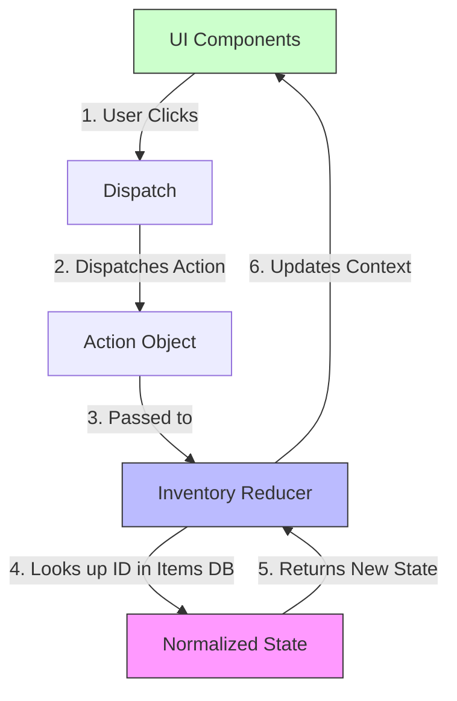

# Inventory System Architecture

## 1. Data Flow (Flux/Redux Pattern)

This diagram shows how data moves in a circle.

```mermaid
graph TD
    %% Nodes
    UI[UI Components]
    Action[Action Object]
    Dispatch[Dispatch]
    Reducer[Inventory Reducer]
    Store[Normalized State]

    %% Connections
    UI -- 1. User Clicks --> Dispatch
    Dispatch -- 2. Dispatches Action --> Action
    Action -- 3. Passed to --> Reducer
    Reducer -- 4. Looks up ID in Items DB --> Store
    Store -- 5. Returns New State --> Reducer
    Reducer -- 6. Updates Context --> UI

    %% Styles
    style Store fill:#f9f,stroke:#333
    style Reducer fill:#bbf,stroke:#333
    style UI fill:#cfc,stroke:#333
```